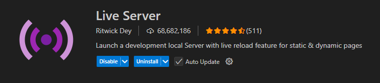
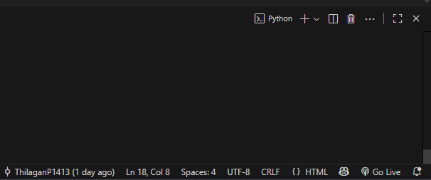

# Pixel-D Exhibit
This is made for digitally exhibiting posters made by us (Kumaraguru Pixel'D) with just a browser

## To Run the PixelD-Exhibit:
**1) Clone this repo:**

Open VS Code and Navigate to a prefered Location. In the terminal, run
```
git clone https://github.com/ThilaganP1413/PixelD-Exhibit.git
```
Now the repo will be cloned

**2) Launching in Browser:**

Install this extension in VS Code 

Open `index.html` file and click on the `Go Live` button at the bottom right corner

